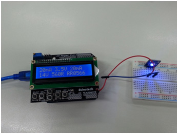
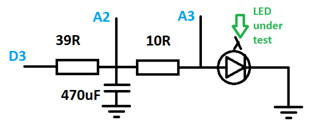
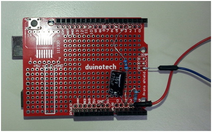

# Arduino Based LED Tester

A handy little tool that can help you out if you work with LED’s a lot, especially if you are always trying to work out the right resistor to make them work. The idea has been shamelessly borrowed from Dave Cook’s model at http://robotroom.com/LED-Tester-Pro-1.html. I’ve written the code from scratch to suit the parts we have available in the Duinotech range.

The display shows target current, LED forward voltage, actual test current on the first line and target supply voltage, suggested resistance and suggested Jaycar part number from the ½W range. If the resistor would dissipate more than half a watt, a `P` flashes on the top line to let you know you might need to choose a more powerful resistor.

The other good thing about this project is that apart from the custom shield we’re going to build out of the prototyping shield, all the boards can just be pulled apart and reused.

## Bill of Materials

| Qty | Code                                    | Description                     |
| --- | --------------------------------------- | ------------------------------- |
| 1   | [XC4410](http://jaycar.com.au/p/XC4410) | UNO Board                       |
| 1   | [XC4482](http://jaycar.com.au/p/XC4482) | prototyping shield              |
| 1   | [XC4454](http://jaycar.com.au/p/XC4454) | LCD controller                  |
| 1   | [RR0538](http://jaycar.com.au/p/RR0538) | 39R 1/2W Resistor               |
| 1   | [RR0524](http://jaycar.com.au/p/RR0524) | 10R 1/2W Resistor               |
| 1   | [RE6194](http://jaycar.com.au/p/RE6194) | 470u 16V electrolytic capacitor |

I’ve used a couple of jumper wires as test leads, but any old wire should do. You could even use test leads with sockets in the end (like WC6028) and push the legs of the LED’s in.

## Connection Table

| Connections        |     |     |
| ------------------ | --- | --- |
| 470uF capacitor    | A2  | GND |
| 39R Resistor       | A2  | D3  |
| 10R Resistor       | A2  | A3  |
| Positive test Lead | D3  |     |
| Negative Test Lead | GND |     |

## Assembly

Here is the circuit diagram of the custom shield:

And what it looks like assembled:

Note that I’ve used the GND connection on the ICSP header for the test lead. There should be enough length in the component legs that extra wire isn’t needed. The only other thing to watch out for is that the negative (white stripe) side of the capacitor goes to GND.

When this is assembled, connect the Uno to the bottom of the new shield and the LCD shield to the top.

## Programming

If you haven’t already, download and install the Arduino IDE from https://www.arduino.cc/en/Main/Software, and check that the drivers are installed for the Uno board.

Open the sketch file in the Arduino IDE and upload it to the Uno, making sure Uno is selected from Tools>Board, and that the correct serial port for the Uno is selected from Tools>Port.

## Use

After this, the Arduino LED Tester should spring into life. With no LED attached, it will not show a resistor value. Connect an LED between the test leads and the LED will light up, and the display will show its characteristics operating from a 14V supply at 10mA. The target voltage can be changed between 1V and 99V with the up and down buttons on the display, and the left and right buttons change the target current (up to 20mA).

## Future Improvements

With only software changes, the Tester could also be modified to test other 2-legged components, so it might be possible to use it as a capacitance meter. Of course, it can tell you the forward voltage of regular diodes in its current form.
